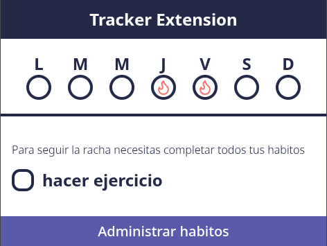

# Tracker extension

Tracker extension is a Google extension that prioritizes your habits by allowing you to visualize your progress throughout the week.



**Project in progress, not yet officially published**

## Run locally

```bash
git clone https://github.com/eldanielhumberto/tracker-extension.git
cd tracker-extension
```

```bash
npm install # pnpm, yarn, bun
```

```bash
npm run watch # pnpm, yarn, bun
```

## Contributions

Feel free to contribute to this project by opening issues or submitting pull requests. Your feedback and suggestions are welcome!

1. **Fork** the repository.

2. **Clone your fork** to your local machine:
    ```bash
    git clone https://github.com/tu-usuario/tracker-extension.git
    cd tracker-extension
    ```
3. **Create a new branch** for your feature or fix:
    ```bash
    git switch -c nombre-de-tu-rama
    ```
4. **Make your changes** and commit with descriptive names:
    ```bash
    git add .
    git commit -m "Descripción de los cambios"
    ```
5. **Push your changes** to your fork:
    ```bash
    git push origin nombre-de-tu-rama
    ```
6. **Open a Pull Request** to the original repository describing your changes.

There are no strict formatting rules in this project.  
You can write the code however you like, as long as it is readable and functional.

💡 _Tip:_ Although we don't require a specific style, neat code always makes the next developer who reads it happier. 😸

## Credits

This project has started using the following repository as a template: [react-vite-chrome-extension](https://github.com/timelessco/react-vite-chrome-extension)
